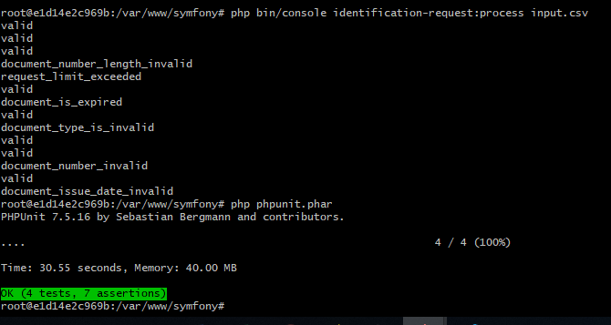

## Installation (In my case I used php 7.1 and symfony 3.4)


1. Build/run containers with detached mode
   * `docker-compose up -d`
   * `docker-compose ps` (to check installed containers)
   * `composer install` (Prepare Symfony app and follow default wizard default input just enter)

2. For going to docker container (just we need php container)
    * `docker-compose exec php bash` (In my case I needed to add `winpty docker-compose exec php bash`)
    *  Within container-> /var/www/symfony : `composer update` (To confirm phpunit install)   
    *  Within container-> /var/www/symfony : `cat input.csv` (To see input)
    *  Within container-> /var/www/symfony : 
    `php bin/console identification-request:process input.csv` (For running command console with argument)
    *  Within container-> /var/www/symfony : `php phpunit.phar` (For unit testing) or `./vendor/bin/phpunit`  

## Sample Output



## How it works?

Have a look at the `docker-compose.yml` file, here are the `docker-compose` built images:

* `php`: This is the PHP-FPM container in which the application volume is mounted,
* `nginx`: This is the Nginx webserver container in which application volume is mounted too,

This results in the following running containers:

```bash
$ `docker-compose ps`
           Name                          Command               State              Ports            
--------------------------------------------------------------------------------------------------
dockersymfony_nginx_1         nginx                            Up      443/tcp, 0.0.0.0:80->80/tcp
dockersymfony_php_1           php-fpm                          Up      0.0.0.0:9000->9000/tcp      
```

## Useful commands

```bash
# bash commands
`docker-compose up -d`
`docker-compose exec php bash`
`docker-compose exec nginx bash`

